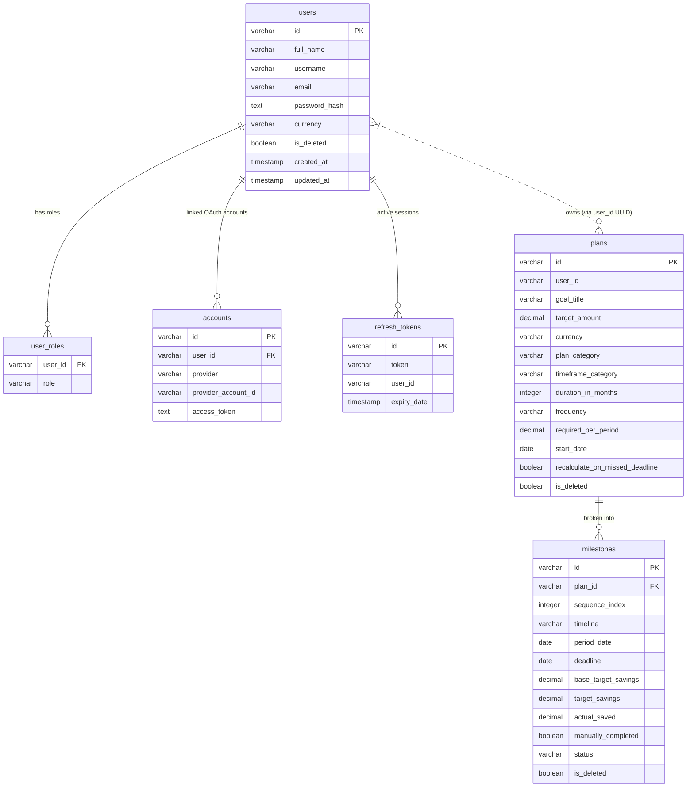

# FinTrack — Full-Stack Architecture Documentation

> **Purpose:** This document is the primary knowledge base for the FinTrack project. It covers system architecture, database schema, API contracts, frontend structure, data flows, and environment setup across both the Backend (BE) and Frontend (FE) workspaces.

---

# 1. Project Overview

## Business Purpose

**FinTrack** (branded as **FinPlan** in the UI) is a personal financial planning web application. Its core feature is helping users create structured savings plans toward specific financial goals. The system breaks each goal down into a time-phased milestone schedule, tracks progress per period, automatically redistributes missed savings into future milestones, and can leverage Google Gemini AI to generate budget plans from natural-language prompts.

## Core Features

- **User Registration & Authentication** — email/username + password with JWT access tokens and rotating refresh tokens.
- **Savings Plan Management** — create, view, update, and delete financial goals with configurable timeframe, currency, and contribution frequency.
- **Milestone Scheduling** — automatic generation of daily, monthly, or annual milestone schedules with deadline tracking and status (`PENDING`, `COMPLETED`, `OVERDUE`).
- **Milestone Tracking** — log actual savings per period; manually complete or undo a milestone.
- **Deficit Redistribution** — when `recalculateOnMissedDeadline` is enabled, missed amounts are spread across future milestones automatically.
- **AI Plan Generation** — submit a natural-language prompt to receive a structured budget plan via Google Gemini.
- **Role-based Access Control** — `ADMIN` and `USER` roles enforced at both API and UI layers.

## Tech Stack

| Layer | Technology |
|---|---|
| **Frontend** | Next.js 16 (App Router), React 19, TypeScript 5 |
| **Styling** | Tailwind CSS v4, SCSS (custom properties + BEM classes) |
| **Backend** | Java 17, Spring Boot 3.4.4, Spring Cloud 2024.0.1 |
| **Architecture Pattern** | Microservices (4 services) |
| **Service Discovery** | Netflix Eureka (Spring Cloud) |
| **Authentication** | Stateless JWT (HMAC-SHA), Spring Security |
| **Database** | PostgreSQL 16 (one DB per service) |
| **ORM** | Spring Data JPA / Hibernate |
| **AI Integration** | Google Gemini via Spring AI (`ChatClient`) |
| **Build Tool (BE)** | Maven (multi-module, `./mvnw`) |
| **Package Manager (FE)** | Yarn |
| **Containerisation** | Docker, Docker Compose |
| **Cloud / Deployment** | Render.com (free tier, Singapore region) |
| **API Documentation** | SpringDoc OpenAPI 3 / Swagger UI |

---

# 2. Database Architecture & Relationships

Each microservice owns its own PostgreSQL database. There are **no shared tables** and **no cross-service foreign keys** at the database level. Cross-service references are soft links via `user_id` UUID strings.

## Service → Database Map

| Service | Database Name |
|---|---|
| `auth-service` | `fintrack_auth` |
| `planning-service` | `fintrack_planning` |

## Auth Service — `fintrack_auth`

### Table: `users`

| Column | Type | Constraints |
|---|---|---|
| `id` | `VARCHAR(36)` | PK, UUID, not updatable |
| `full_name` | `VARCHAR(100)` | nullable |
| `username` | `VARCHAR(50)` | UNIQUE, NOT NULL |
| `email` | `VARCHAR(100)` | UNIQUE, NOT NULL |
| `password_hash` | `TEXT` | NOT NULL (BCrypt) |
| `currency` | `VARCHAR` (enum) | nullable — `VND`, `USD` |
| `created_at` | `TIMESTAMP` | auto-set (JPA audit) |
| `updated_at` | `TIMESTAMP` | auto-updated (JPA audit) |
| `created_by` | `VARCHAR(36)` | auto-set (JPA audit) |
| `updated_by` | `VARCHAR(36)` | auto-set (JPA audit) |
| `is_deleted` | `BOOLEAN` | NOT NULL, default `false` (soft-delete) |

### Table: `user_roles` *(element collection on `users`)*

| Column | Type | Constraints |
|---|---|---|
| `user_id` | `VARCHAR(36)` | FK → `users.id` |
| `role` | `VARCHAR(20)` | NOT NULL — `ADMIN`, `USER` |

### Table: `accounts` *(OAuth2 linked accounts)*

| Column | Type | Constraints |
|---|---|---|
| `id` | `VARCHAR(36)` | PK, UUID |
| `user_id` | `VARCHAR(36)` | FK → `users.id`, NOT NULL |
| `provider` | `VARCHAR(50)` | NOT NULL (e.g. `google`, `github`) |
| `provider_account_id` | `VARCHAR(255)` | NOT NULL |
| `access_token` | `TEXT` | NOT NULL |

Indexes: `idx_accounts_user_id`, `idx_accounts_provider`, `idx_accounts_provider_account_id`, unique on `(user_id, provider, provider_account_id)`.

### Table: `refresh_tokens`

| Column | Type | Constraints |
|---|---|---|
| `id` | `VARCHAR(36)` | PK, UUID |
| `token` | `VARCHAR(36)` | UNIQUE, NOT NULL |
| `user_id` | `VARCHAR(36)` | NOT NULL (soft FK) |
| `expiry_date` | `TIMESTAMP` | NOT NULL |

Indexes: `idx_refresh_tokens_token` (unique), `idx_refresh_tokens_user_id`.

---

## Planning Service — `fintrack_planning`

### Table: `plans`

| Column | Type | Constraints |
|---|---|---|
| `id` | `VARCHAR(36)` | PK, UUID, not updatable |
| `user_id` | `VARCHAR(36)` | NOT NULL, not updatable (soft FK to `users.id`) |
| `goal_title` | `VARCHAR(50)` | NOT NULL |
| `target_amount` | `DECIMAL(19,2)` | NOT NULL |
| `currency` | `VARCHAR(3)` | NOT NULL — `VND`, `USD` |
| `plan_category` | `VARCHAR(20)` | nullable — `EMERGENCY`, `TRAVEL`, `HOUSE`, `CAR`, `EDUCATION`, `WEDDING`, `RETIREMENT`, `OTHER` |
| `timeframe_category` | `VARCHAR(20)` | NOT NULL — `SHORT_TERM`, `MID_TERM`, `LONG_TERM` |
| `duration_in_months` | `INTEGER` | nullable |
| `duration_in_years` | `INTEGER` | nullable (legacy) |
| `frequency` | `VARCHAR(20)` | NOT NULL — `DAILY`, `MONTHLY`, `ANNUALLY` |
| `required_per_period` | `DECIMAL(19,2)` | NOT NULL |
| `start_date` | `DATE` | NOT NULL |
| `recalculate_on_missed_deadline` | `BOOLEAN` | NOT NULL, default `false` |
| `created_at` | `TIMESTAMP` | auto-set |
| `updated_at` | `TIMESTAMP` | auto-updated |
| `created_by` / `updated_by` | `VARCHAR(36)` | JPA audit |
| `is_deleted` | `BOOLEAN` | NOT NULL, default `false` |

Index: `idx_plans_user_id`.

### Table: `milestones`

| Column | Type | Constraints |
|---|---|---|
| `id` | `VARCHAR(36)` | PK, UUID |
| `plan_id` | `VARCHAR(36)` | FK → `plans.id`, NOT NULL |
| `sequence_index` | `INTEGER` | NOT NULL |
| `timeline` | `VARCHAR(50)` | NOT NULL (e.g. `"Day 1"`, `"January 2027"`) |
| `period_date` | `DATE` | NOT NULL |
| `deadline` | `DATE` | NOT NULL |
| `base_target_savings` | `DECIMAL(19,2)` | NOT NULL, not updatable |
| `target_savings` | `DECIMAL(19,2)` | NOT NULL (redistributed amount) |
| `actual_saved` | `DECIMAL(19,2)` | NOT NULL, default `0` |
| `manually_completed` | `BOOLEAN` | NOT NULL, default `false` |
| `status` | `VARCHAR(20)` | NOT NULL, default `PENDING` — `PENDING`, `COMPLETED`, `OVERDUE` |
| `created_at` / `updated_at` | `TIMESTAMP` | JPA audit |
| `created_by` / `updated_by` | `VARCHAR(36)` | JPA audit |
| `is_deleted` | `BOOLEAN` | NOT NULL, default `false` |

Indexes: `idx_milestones_plan_id`. Unique constraint: `uq_milestones_plan_seq` on `(plan_id, sequence_index)`.

---

## Entity Relationship Diagram



---

# 3. Backend (BE) Architecture

## Workspace

`/Users/hieule/fintrack`

## Directory Structure

```
fintrack/                          # Git repo root
├── pom.xml                        # Parent Maven POM (multi-module)
├── mvnw / mvnw.cmd                # Maven wrapper
├── docker-compose.yml             # Local dev stack
├── render.yaml                    # Render.com deployment config
├── .env.example                   # Environment variable template
├── postgres/init.sql              # DB bootstrap SQL
├── pgadmin/servers.json           # pgAdmin config
├── docs/                          # Per-service Markdown docs
├── core/                          # Shared library module (no main class)
├── config-service/                # Eureka Service Registry (port 8761)
├── auth-service/                  # Authentication & User service (port 8081)
├── planning-service/              # Financial Planning service (port 8090)
└── service-template/              # Scaffold for future services
```

## Architectural Pattern: Microservices

The backend is a Spring Cloud microservices system. Each service:
- Runs as an independent Spring Boot application with its own PostgreSQL database.
- Registers with the Eureka service registry on startup.
- Validates JWT tokens independently (no shared session store).
- Packages shared code via the `core` library module.

### Service Summary

| Module | Port | Role |
|---|---|---|
| `core` | — | Shared library: `BaseEntity`, `ApiResponse<T>`, `PageResponse<T>`, `AppException`, `GlobalExceptionHandler`, `ErrorCode`, `DateUtils` |
| `config-service` | 8761 | Netflix Eureka server. Service discovery registry. HTTP Basic protected. |
| `auth-service` | 8081 | Registration, login, refresh-token rotation, user profile, JWT issuance. |
| `planning-service` | 8090 | Savings plan CRUD, milestone schedule generation, deficit redistribution, Gemini AI integration. |

## Package Structure (per service)

Each service follows the same layered structure:

```
com.fintrack.<service>/
├── <Service>Application.java      # Main class
├── config/                        # Spring config beans (Security, OpenAPI, etc.)
├── controller/                    # @RestController — thin, delegates to service
├── dto/
│   ├── request/                   # Inbound request bodies
│   └── response/                  # Outbound response objects
├── filter/                        # JwtAuthFilter (OncePerRequestFilter)
├── model/                         # JPA entities + enums
├── repository/                    # Spring Data JPA repositories
└── service/                       # Business logic interface + impl/
```

## API Endpoints

### Auth Service — base: `http://localhost:8081`

All responses are wrapped in `ApiResponse<T>` — `{ code, message, data, timestamp }`.

| Method | Path | Auth | Description |
|---|---|---|---|
| `POST` | `/api/v1/auth/register` | None | Register a new user. Returns `UserResponse`. |
| `POST` | `/api/v1/auth/login` | None | Credential login. Returns `AuthResponse` (access + refresh tokens). |
| `POST` | `/api/v1/auth/refresh` | None | Exchange refresh token for new token pair. Old token is revoked. |
| `POST` | `/api/v1/auth/logout` | Bearer JWT | Revoke all refresh tokens for the authenticated user. `204 No Content`. |
| `GET` | `/api/v1/users/profile` | Bearer JWT | Return authenticated user's `UserResponse`. |
| `GET` | `/actuator/health` | None | Spring Boot health check. |
| `GET` | `/swagger-ui.html` | None | OpenAPI interactive docs. |

### Planning Service — base: `http://localhost:8090`

All endpoints require a valid `Authorization: Bearer <access_token>` header. Ownership of plans is enforced in the service layer.

| Method | Path | Description |
|---|---|---|
| `POST` | `/api/v1/plans` | Create a savings plan. Generates full milestone schedule. Returns `PlanResponse` 201. |
| `GET` | `/api/v1/plans` | List the caller's plans (summary, no milestone detail). Returns `List<PlanSummaryResponse>`. |
| `GET` | `/api/v1/plans/{planId}` | Get full plan with live-recomputed milestones. Returns `PlanResponse`. |
| `PATCH` | `/api/v1/plans/{planId}/milestones/{milestoneId}` | Update `actualSaved` on a milestone. Returns `PlanResponse`. |
| `POST` | `/api/v1/plans/{planId}/milestones/{milestoneId}/complete` | Manually mark a milestone complete. Returns `PlanResponse`. |
| `POST` | `/api/v1/plans/{planId}/milestones/{milestoneId}/undo` | Undo manual completion. Returns `PlanResponse`. |
| `PATCH` | `/api/v1/plans/{planId}/settings` | Toggle `recalculateOnMissedDeadline`. Returns `PlanResponse`. |
| `DELETE` | `/api/v1/plans/{planId}` | Hard delete plan and all its milestones. `204 No Content`. |
| `POST` | `/api/v1/plans/ai/generate` | Submit natural-language prompt to Gemini. Returns `AiPlanResponse`. |

## Authentication & Authorization Flow

The system uses **stateless JWT** — no HTTP sessions, no shared session store.

**Token structure:**
- **Access token** — HMAC-SHA signed JWT, 15-minute lifetime (default `900_000 ms`). Claims: `sub` (username), `userId`, `email`, `roles`, `iat`, `exp`.
- **Refresh token** — opaque UUID string stored in `refresh_tokens` table, 7-day lifetime.

**Filter chain (both services):** `JwtAuthFilter extends OncePerRequestFilter`
1. Extract `Authorization: Bearer <token>` header.
2. Parse and validate the JWT signature and expiry using `FINTRACK_JWT_SECRET`.
3. `auth-service`: load full `UserDetails` from DB; set `UsernamePasswordAuthenticationToken` with the `User` entity as principal.
4. `planning-service`: no local user store — extract `userId` claim; set `UsernamePasswordAuthenticationToken` with `userId` string as principal.
5. Any invalid token clears the security context; the endpoint returns 401.

**Authorization rules:**
- `@EnableMethodSecurity` + `@PreAuthorize("isAuthenticated()")` on logout.
- Planning service: `getOwnedPlanOrThrow(planId, userId)` verifies `plan.getUserId().equals(userId)` — throws `FORBIDDEN (1002)` on mismatch.
- Role-based: `ADMIN` and `USER` roles carried in the JWT `roles` claim.

**Startup secret guard (`@PostConstruct`):** Both services reject startup if `FINTRACK_JWT_SECRET` is < 32 characters or contains the string `"change-me"`.

## Validation & Error Handling

**Bean Validation (`@Valid` on all controller request bodies):**

`RegisterRequest`:
- `username`: `@NotBlank`, `@Size(3–30)`, `@Pattern(^[a-zA-Z0-9_]+$)`
- `email`: `@NotBlank`, `@Email`
- `password`: `@NotBlank`, `@Size(min=8)`, must contain a digit (`@Pattern(.*\\d.*)`)
- `fullName`: `@Size(2–100)` (optional)

`CreatePlanRequest`:
- `goalTitle`: `@NotBlank`, `@Size(max=50)`
- `targetAmount`: `@NotNull`, `@DecimalMin("0.01")`
- `currency`, `frequency`: `@NotNull`
- `durationInMonths`: `@Min(3)`, `@Max(720)`
- `durationInYears`: `@Min(1)`, `@Max(20)`

**Business rule validation (service layer):**
- Duplicate username/email check on registration.
- `MilestoneCalculator.validateCombination()`: enforces legal timeframe + frequency + duration field combinations (e.g. `SHORT_TERM`/`MID_TERM` only allow `DAILY` or `MONTHLY`, require `durationInMonths`).
- `periodCount` guard: `> 0` and `<= 3650` to prevent runaway schedule generation.

**Error handling (`GlobalExceptionHandler` in `core`):**
- `AppException` → mapped `ErrorCode` → HTTP status + numeric code in body.
- `MethodArgumentNotValidException` → 400 with `{ fieldName: message }` map.
- Catch-all `Exception` → 500 with a generic message; stack trace is never exposed.

**Error code conventions:**
- `1xxx` — general / access errors (e.g. `1001 UNAUTHENTICATED`, `1002 FORBIDDEN`)
- `3xxx` — auth/user errors (e.g. `3001 INVALID_CREDENTIALS`, `3002 DUPLICATE_EMAIL`)
- `4xxx` — planning errors (e.g. `4001 PLAN_NOT_FOUND`, `4002 MILESTONE_NOT_FOUND`)

## Scheduled Jobs & Caching

| Component | Service | Behavior |
|---|---|---|
| `TokenCleanupScheduler` | `auth-service` | `@Scheduled(cron="0 0 2 * * *")` — deletes expired refresh tokens daily at 02:00 AM. |
| Caffeine cache | `auth-service` | `userProfiles` cache — `maximumSize=1000, expireAfterWrite=300s`. Applied to `getProfile()`. |

---

# 4. Frontend (FE) Architecture

## Workspace

`/Users/hieule/fintrackfe`

## Directory Structure

```
fintrackfe/
├── src/
│   ├── app/                        # Next.js App Router pages + API routes
│   │   ├── (auth)/                 # Route group — no auth guard (login, register)
│   │   │   ├── login/page.tsx
│   │   │   └── register/page.tsx
│   │   ├── (protected)/            # Route group — admin only
│   │   │   └── admin/page.tsx
│   │   ├── api/                    # BFF (Backend-for-Frontend) route handlers
│   │   │   ├── auth/               # login, logout, register, refresh, profile
│   │   │   ├── planning/[...path]/ # Catch-all proxy to planning service
│   │   │   ├── users/profile/
│   │   │   └── health/
│   │   ├── dashboard/page.tsx      # Main authenticated landing page
│   │   ├── plan/
│   │   │   ├── create/page.tsx     # Multi-step plan creation form
│   │   │   ├── ai-generate/page.tsx
│   │   │   └── [id]/page.tsx       # Plan detail + milestones table
│   │   ├── settings/page.tsx
│   │   ├── layout.tsx              # Root layout (fonts, AppShell)
│   │   ├── page.tsx                # Root redirect (→ /dashboard or /login)
│   │   ├── globals.scss            # SCSS global styles + BEM classes
│   │   └── tailwind.css            # Tailwind v4 entry + @theme tokens
│   ├── components/
│   │   ├── common/                 # app-shell, header, footer, page-container
│   │   └── ui/                     # button, card, input, select, typography,
│   │                               # stat-card, plan-card, confirm-modal
│   ├── config/
│   │   ├── cookies.ts              # Cookie name constants + option presets
│   │   ├── env.ts                  # All env vars with defaults
│   │   └── routes.ts               # Centralised route path constants
│   ├── features/
│   │   ├── auth/                   # Auth service, hooks, store, components, server adapters
│   │   └── planning/               # Planning service, server adapters, components
│   ├── hooks/use-debounce.ts
│   ├── lib/cn.ts                   # className utility (no external dep)
│   ├── proxy.ts                    # Next.js middleware (auth guard)
│   ├── services/
│   │   ├── http.ts                 # Client-side fetch wrapper
│   │   └── interceptor.ts          # 401 → logout + redirect
│   ├── store/index.ts              # appStore scaffold (unused)
│   ├── styles/                     # SCSS variables + mixins
│   ├── types/index.ts              # Nullable<T> utility
│   └── utils/roles.ts              # hasRole() helper
```

## State Management

There is **no external state management library**. The application uses four complementary mechanisms:

| Mechanism | Location | Scope |
|---|---|---|
| **Module-level singleton** | `src/features/auth/store.ts` — `authStore` | Process lifetime; survives navigation. Holds user identity object after login. Does **not** trigger re-renders. |
| **React `useState`** | All components | Local UI state — form fields, loading flags, modal open/close. |
| **`sessionStorage` cache** | `use-profile.ts` (key `fintrack_profile`) | Survives page refreshes within a tab. Cleared on logout. |
| **HttpOnly cookies** | Set by BFF routes | Source of truth for session validity. Not accessible to JS. |

Server-side cache invalidation uses Next.js `revalidatePath("/dashboard")` after plan mutations.

## Routing Architecture

Routing is file-system based via the Next.js App Router. Route protection uses middleware (`src/proxy.ts`).

| Route | Component type | Guard |
|---|---|---|
| `/` | Server — redirects | Cookie check |
| `/login` | Server | Redirect to `/dashboard` if already authed |
| `/register` | Server | None |
| `/dashboard` | Server (async) | Middleware: needs `access_token` cookie |
| `/plan/create` | Client | Middleware |
| `/plan/[id]` | Server (async) | Middleware |
| `/plan/ai-generate` | Client | Middleware |
| `/settings` | Client | Middleware |
| `/admin` | Server | Middleware: needs `ADMIN` role in `roles` cookie |

**Middleware** (`src/proxy.ts`, matched to `/dashboard/:path*` and `/admin/:path*`):
- Reads `access_token` cookie. If absent → `redirect("/login")`.
- For `/admin/*` → reads `roles` cookie, calls `hasRole(user, "ADMIN")`. If false → `redirect("/dashboard")`.

## Core UI Components

| Component | Purpose |
|---|---|
| `AppShell` | Wraps all pages. Hides header/footer on `/login` and `/register`. |
| `Header` | Top nav — FinPlan brand, Dashboard and Settings links. Active link via `usePathname()`. |
| `Button` | Variants: `primary`, `secondary`, `ghost`, `danger`. Sizes: `md`, `sm`. |
| `Card` | Container with `--ui-card` SCSS class (border, shadow, padding). |
| `Input` / `Select` | `forwardRef` field wrappers with `label` and `hint` support. |
| `Typography` | Polymorphic; 10 variants (`h1–h3`, `body`, `body-sm`, `muted`, `caption`, `eyebrow`, `label`, `title`). |
| `StatCard` | KPI tile with icon, label, value. Three color variants: blue, green, amber. |
| `PlanCard` | Active plan card with progress bar, amounts, delete button. |
| `ConfirmModal` | Accessible delete dialog (Escape key + backdrop-click to cancel). |
| `MilestonesTable` | Inline-editable milestone list. Supports actualSaved update, complete, undo. |
| `PlanDetailClient` | Displays 4 stat cards + `MilestonesTable`. Updates totals locally after milestone actions. |
| `LoginForm` / `RegisterForm` | Auth forms calling `useAuth()` hooks. |

## Styling

A hybrid approach combining SCSS and Tailwind v4:

- **SCSS** (`globals.scss`, `_variables.scss`, `_mixins.scss`) defines all CSS custom properties (design tokens: `--bg-canvas`, `--text-main`, `--brand`, `--ok`, `--warn`, etc.) and BEM-style component classes (`.ui-button--primary`, `.ui-card`, `.ui-input`, `.app-shell`, `.page-container`, etc.).
- **Tailwind v4** (`tailwind.css`) is used for layout/spacing utilities inline in components. An `@theme` block extends Tailwind with custom color and typography tokens.
- **Google Fonts**: `Manrope` (`--font-body`) and `Space Grotesk` (`--font-display`) loaded via `next/font/google`.

## FE ↔ BE Communication

The browser **never calls the backend services directly**. All traffic passes through one of two Next.js channels:

### Path A — Server Actions (primary, for planning reads/writes)

```
Client/Server component
  → "use server" fn in planning.facade.ts
    → planning.service.ts
      → fetch(PLANNING_SERVICE_BASE_URL + path, {
          Authorization: "Bearer <token-read-from-cookie-server-side>"
        })
```

Used by: `getPlans`, `getPlan`, `createPlan`, `deletePlan`, `updateMilestone`, `completeMilestone`, `generateAiPlan`, `toggleRecalculate`.

### Path B — BFF Catch-All Proxy (client-side milestone interactions)

```
Client component (MilestonesTable, PlanDetailLoader)
  → src/services/http.ts (fetch with credentials: "include")
    → /api/planning/[...path] BFF route
      → fetch(PLANNING_SERVICE_BASE_URL + path, {
          Authorization: "Bearer <token-from-HttpOnly-cookie>"
        })
```

The catch-all BFF route also handles silent token refresh: if the upstream 401s, it attempts `POST /api/v1/auth/refresh` with the refresh token cookie, then retries.

### Path C — Auth BFF Routes (always)

```
Client (authService.ts)
  → /api/auth/* BFF route
    → auth.facade.ts
      → fetch(AUTH_SERVICE_BASE_URL + path)
```

### API Route Map

| Frontend Path | Method | Backend Service | Backend Path |
|---|---|---|---|
| `/api/auth/login` | POST | Auth `:8081` | `/api/v1/auth/login` |
| `/api/auth/logout` | POST | Auth | `/api/v1/auth/logout` |
| `/api/auth/register` | POST | Auth | `/api/v1/auth/register` |
| `/api/auth/profile` | GET | Auth | `/api/v1/users/profile` |
| `/api/auth/refresh` | POST | Auth | `/api/v1/auth/refresh` |
| `/api/planning/[...path]` | * | Planning `:8090` | Pass-through |
| Server action `getPlans` | — | Planning | `GET /api/v1/plans` |
| Server action `createPlan` | — | Planning | `POST /api/v1/plans` |
| Server action `deletePlan` | — | Planning | `DELETE /api/v1/plans/{id}` |
| Server action `generateAiPlan` | — | Planning | `POST /api/v1/plans/ai/generate` |

---

# 5. Core Workflows & Data Flow

## Workflow 1: User Login

```
Browser                   Next.js BFF              auth-service           DB
  │                           │                         │                   │
  │── POST /api/auth/login ──►│                         │                   │
  │   { emailOrUsername,      │── POST /api/v1/auth/login ──────────────►  │
  │     password }            │   { emailOrUsername, password }             │
  │                           │                         │── SELECT users ──►│
  │                           │                         │◄── User record ───│
  │                           │                         │  BCrypt.verify()  │
  │                           │                         │── INSERT refresh ─►│
  │                           │                         │◄── { accessToken, │
  │                           │◄────────────────────────│    refreshToken } │
  │                           │                         │                   │
  │                           │  Set HttpOnly cookies:  │                   │
  │                           │  access_token (15 min)  │                   │
  │                           │  refresh_token (7 days) │                   │
  │                           │  roles (1 day)          │                   │
  │◄── { authenticated: true, │                         │                   │
  │      user }               │                         │                   │
  │                           │                         │                   │
  │  authStore.setUser(user)  │                         │                   │
  │  router.push("/dashboard")│                         │                   │
```

**Step-by-step:**
1. `LoginForm` calls `useAuth().login({ emailOrUsername, password })`.
2. `authService.login()` sends `POST /api/auth/login` (relative URL, BFF).
3. BFF route (`/api/auth/login/route.ts`) forwards the body to `AUTH_SERVICE_BASE_URL/api/v1/auth/login` via `auth.facade.ts`.
4. `auth-service` validates credentials: loads user by username/email, `BCrypt.matches(password, passwordHash)`. Throws `INVALID_CREDENTIALS (3001)` on mismatch.
5. On success: generates a signed JWT access token (15 min) and a UUID refresh token (7 days), persists the refresh token to `refresh_tokens`.
6. BFF receives the `AuthResponse`, normalises the token field names (handles `accessToken`, `access_token`, `token`, `jwt` and nested `data`/`result`/`payload`), then sets three HttpOnly cookies on the browser response.
7. Browser stores no tokens in JS memory. `authStore` stores only the `user` object.
8. Middleware will now allow access to `/dashboard` because the `access_token` cookie is present.

---

## Workflow 2: Creating a Savings Plan

```
Browser                  Next.js Server Action     planning-service          DB
  │                           │                         │                    │
  │─ (form submit) ──────────►│  createPlan server fn   │                    │
  │                           │── POST /api/v1/plans ──►│                    │
  │                           │   { goalTitle, target,  │                    │
  │                           │     currency, duration, │── INSERT plans ───►│
  │                           │     frequency, ... }    │◄── plan.id ────────│
  │                           │   Authorization: Bearer │                    │
  │                           │   <token from cookie>   │  MilestoneCalculator│
  │                           │                         │  validateCombination│
  │                           │                         │  generateSchedule()│
  │                           │                         │── INSERT milestones►│
  │                           │                         │   (bulk, N rows)   │
  │                           │◄── PlanResponse (201) ──│                    │
  │                           │                         │                    │
  │                           │  revalidatePath("/dashboard")                │
  │◄── redirect /plan/{id} ───│                         │                    │
```

**Step-by-step:**
1. User fills the multi-step create form at `/plan/create`. Client calls the `createPlan` server action.
2. `planning.facade.ts` reads the `access_token` cookie server-side and calls `planning.service.ts`, which sends `POST /api/v1/plans` with the JWT in the `Authorization` header.
3. `planning-service` `JwtAuthFilter` validates the token and extracts `userId` from the `userId` claim.
4. `PlanController` receives `CreatePlanRequest` and passes it to `PlanServiceImpl.createPlan(request, userId)`.
5. `MilestoneCalculator.validateCombination()` enforces legal timeframe/frequency/duration combinations. If invalid, throws an `AppException`.
6. `MilestoneCalculator.generateSchedule()` computes N milestone rows (period date, deadline, `base_target_savings = requiredPerPeriod`). `periodCount` is validated to be in `[1, 3650]`.
7. `PlanEntity` is persisted, then all `MilestoneEntity` rows are bulk-inserted via `milestoneRepository.saveAll()`.
8. Service returns a `PlanResponse` containing the plan and all milestones.
9. The server action calls `revalidatePath("/dashboard")` to invalidate the cached plan list.
10. The user is redirected to `/plan/{id}` to see their new plan with its full milestone table.

---

# 6. Environment Setup & Deployment

## Backend Environment Variables (`.env.example`)

```env
# ── PostgreSQL ─────────────────────────────────────────────
POSTGRES_USER=
POSTGRES_PASSWORD=

# ── pgAdmin ────────────────────────────────────────────────
PGADMIN_DEFAULT_EMAIL=
PGADMIN_DEFAULT_PASSWORD=

# ── Eureka Service Registry ─────────────────────────────────
EUREKA_USERNAME=
EUREKA_PASSWORD=
EUREKA_HOST=config-service          # docker-compose service name

# ── JWT ────────────────────────────────────────────────────
FINTRACK_JWT_SECRET=                # Min 32 chars, must not contain "change-me"
FINTRACK_JWT_ACCESS_EXPIRY_MS=900000    # Optional; default 15 min
FINTRACK_JWT_REFRESH_EXPIRY_DAYS=7      # Optional; default 7 days

# ── External APIs ───────────────────────────────────────────
GEMINI_API_KEY=                     # Google AI Studio key (planning-service)

# ── CORS ───────────────────────────────────────────────────
FRONTEND_ORIGIN=http://localhost:3000

# ── Database URLs (per service) ────────────────────────────
# auth-service default: jdbc:postgresql://db:5432/fintrack_auth
# planning-service default: jdbc:postgresql://db:5432/fintrack_planning
POSTGRES_URL=
POSTGRES_USERNAME=

# ── Performance / DDL ──────────────────────────────────────
HIKARI_MAX_POOL=10                  # Optional
JPA_DDL_AUTO=update                 # Optional; use "validate" in prod

# ── Render.com (production only) ───────────────────────────
RENDER_EXTERNAL_HOSTNAME=           # Injected by Render platform
```

## Frontend Environment Variables

```env
# .env (committed default — points to gateway or empty for BFF-only mode)
NEXT_PUBLIC_API_BASE_URL=           # Leave empty for same-origin BFF calls

# .env.local (local dev — direct to individual services)
AUTH_SERVICE_BASE_URL=http://localhost:8081
PLANNING_SERVICE_BASE_URL=http://localhost:8090
NEXT_PUBLIC_APP_NAME=FinTrack
```

## Running Locally

### Option A — Full Docker Compose Stack (recommended for BE)

```bash
# 1. Clone and enter the BE repo
cd /Users/hieule/fintrack

# 2. Copy and fill in env vars
cp .env.example .env
# Edit .env with your values

# 3. Start all services (Postgres, pgAdmin, Eureka, auth, planning)
docker compose up -d

# Services available:
# Eureka dashboard:   http://localhost:8761
# Auth Swagger UI:    http://localhost:8081/swagger-ui.html
# Planning Swagger:   http://localhost:8090/swagger-ui.html
# pgAdmin:            http://localhost:5050
```

### Option B — IntelliJ IDEA (hybrid dev)

```bash
# Start only infrastructure
docker compose up -d db pgadmin config-service

# Run auth-service and planning-service from IntelliJ
# with application.yml env vars configured in Run Configuration
```

### Building Individual Services

```bash
# Build all modules
./mvnw clean install

# Build one service (skip tests)
./mvnw package -pl auth-service    -am -DskipTests
./mvnw package -pl planning-service -am -DskipTests
./mvnw package -pl config-service  -am -DskipTests
```

### Running the Frontend

```bash
cd /Users/hieule/fintrackfe

# Install dependencies
yarn install

# Set local env
cp .env .env.local
# Set AUTH_SERVICE_BASE_URL=http://localhost:8081
# Set PLANNING_SERVICE_BASE_URL=http://localhost:8090

# Start dev server (port 3000)
yarn dev

# Production build
yarn build && yarn start
```

## Production Deployment (Render.com)

Three web services are declared in `render.yaml` — `fintrack-config`, `fintrack-auth`, `fintrack-planning` — each referencing its own `Dockerfile` path within the same repository.

- **Region:** Singapore (`oregon` fallback)
- **Plan:** Free tier
- **Auto-deploy trigger:** every commit to the connected branch
- **Service hostnames:** injected as `RENDER_EXTERNAL_HOSTNAME` per service for Eureka registration

The Dockerfiles use a two-stage build:
1. **Build stage** (`eclipse-temurin:21-jdk-alpine`): caches Maven dependencies, then packages the fat JAR.
2. **Runtime stage** (`eclipse-temurin:21-jre-alpine`): copies the JAR, runs `java -jar`.

The frontend is deployed separately (Vercel or Render static site) with `AUTH_SERVICE_BASE_URL` and `PLANNING_SERVICE_BASE_URL` pointing to the Render service URLs.

---

*Document generated from live source code. Workspace paths: BE at `/Users/hieule/fintrack`, FE at `/Users/hieule/fintrackfe`.*
